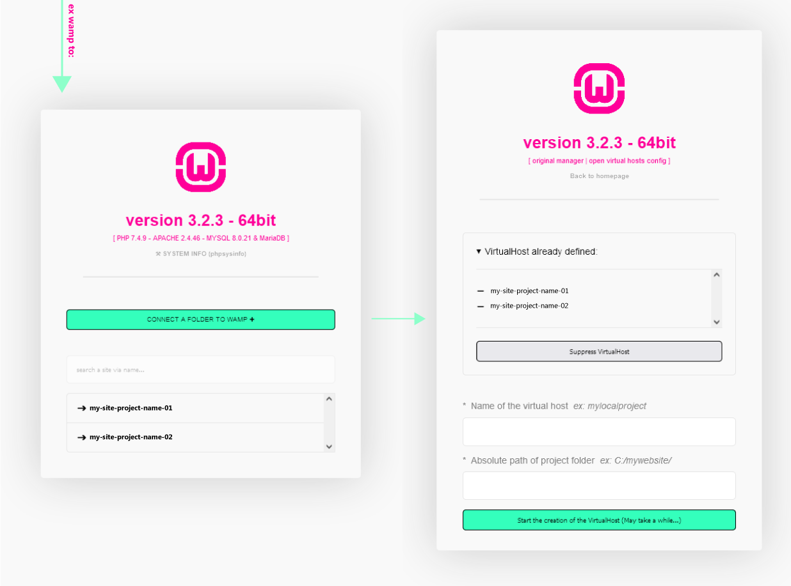

# wamp-theme
<b>{under-costruction}</b> A new Wamp semplified theme<br>
<b>This is prototype, a work in progress, it's not completed project.</b>

---



---

Before flight:

⚠ Not use www folder for your site/app. This version of theme is directly for connect an external folder via an alias.<br>
⚠ Make a backup of www folder for override it

```

    0 - raccomended:
            install latest wamp with php 8.X 
            - latest wamp: https://sourceforge.net/projects/wampserver/files/WampServer%203/WampServer%203.0.0/wampserver3.2.6_x86.exe/download
              if necessary, add php8: https://sourceforge.net/projects/wampserver/files/latest/download
            - open menu in tryicon, go to php > php settings > active short_open_tag


    1 - Move your project out of www

    2 - Backup your wamp classic empty www folder

    3 - Change your www whit this themifized version

    4 - www it's now only fo localhost projects list so...<br>
        Connect the new project location (project per project) in new alias, exemple:<br>
        ex version no alias-> www/mysite01/<br>
        to -> c:/myproject/mysite01<br>

```
